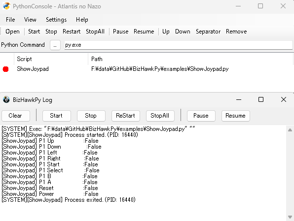

[README in Japanese](README.md)

[](https://github.com/pocokhc/BizHawkPy/releases/latest)

# BizHawkPy

BizHawkPy is an external tool for BizHawk that enables controlling the emulator and retrieving information from Python.  
It functions as a Python equivalent of the existing Lua Console.  
  
It also provides integration code for [Gymnasium](https://github.com/Farama-Foundation/Gymnasium/tree/main), a standard API for reinforcement learning.  


# 1. Installation

This tool is installed as a BizHawk External Tool.  
There are two installation methods:

- Using prebuilt DLLs
- Building from source

> **Note**  
> The BizHawk version and the build artifacts must match exactly.  
> There is no compatibility between different versions.

## 1.1 Using Prebuilt DLLs

### Build environment

- windows11
- BizHawk v2.10.0 / v2.9.1

### Steps

1. Download BizHawk to any location
2. Extract the distributed ZIP and place it under the `ExternalTools` directory:

```text
BizHawk/
 ├─ EmuHawk.exe
 ├─ ExternalTools/
 │    ├─ BizHawkPy.dll
 │    ├─ BizHawkPy/
 │         ├─ *.py
```
3. Launch BizHawk and open:
```
Tools → External Tools → BizHawkPy
```


## 1.2 Building from Source

### Development Environment

* Visual Studio 2026
  * .NET Desktop Development
  * .NET Framework 4.8.1 Development Tools

### Build Steps

1. Clone the repository:

```bash
git clone https://github.com/pocokhc/BizHawkPy.git
cd BizHawkPy
```

2. Build the project:

```bash
dotnet build -c Release /p:BIZHAWK_HOME="Path to BizHawk directory"
```
  
After a successful build, the required files will be generated in the ExternalTools directory of BizHawk.


# 2. Usage

## 2.1 Development environment

Python must be installed separately.

* Python 3.13.13

## 2.2 Launch

After starting BizHawk, select BizHawkPy from the menu:

```
Tools → External Tools → BizHawkPy
```

## 2.3 Console Window

Below is an example of the console window:



- `PythonCommand` allows you to specify the Python interpreter (default: `py` launcher)
- Each `.py` script can be executed and stopped independently
- Logging is handled independently from the emulator, and continues as much as possible even if the emulator stops


# 3. Python Code

BizHawkPy is designed to be used similarly to BizHawk's [Lua functions](https://tasvideos.org/BizHawk/LuaFunctions).  
Below is a basic example:  

```python
# Behavior:
# - The script runs once when started
# - emu.frameadvance() pauses execution and resumes on the next frame
#
# Notes:
# - When using an infinite loop, you must call emu.frameadvance()
# - Otherwise, the script will hang and freeze the emulator
#
# Import:
# - from bizhawk_api import * provides the same API as Lua
# - Examples: emu, joypad, memory, gui

from bizhawk_api import emu

while True:
    print(f"frame: {emu.framecount()}")
    emu.frameadvance()

```

## 3.1 Type Hints

- `py/bizhawk_api.py` or `ExternalTools/BizHawkPy/bizhawk_api.py` can be used as type definitions (for IDE completion and type checking)
These are automatically loaded at runtime, so no `sys.path` modification is required


## 3.2 Gymnasium Integration

For usage examples, see:

- [examples/BizHawkEnv](examples/BizHawkEnv/)


# 4. Progress Summary

| Category  | Total | Implemented | Skipped | Progress | Notes|
| --------- | ---: | ---: | ---: | ---: | -: |
| bit       |    - |    - | - |    - | Implementable in Python|
| bizstring |    - |    - | - |    - | Implementable in Python|
| client    |   59 |   48 | 0 |  81% | |
| comm      |   33 |   30 | 1 |  94% | |
| console   |    5 |    4 | 1 | 100% | Replaced by BizHawkPy console |
| emu       |   19 |   17 | 1 |  95% | emu.emu.yield not implemented |
| event     |   19 |    0 | 0 |   0% | |
| forms     |   44 |    0 | 0 |   0% | |
| gameinfo  |    7 |    7 | 0 | 100% | |
| gensis    |    8 |    0 | 0 |   0% | |
| gui       |   28 |   25 | 0 |  89% | |
| input     |    3 |    - | - |    - | Handled in Python|
| joypad    |    6 |    6 | 0 | 100% | |
| LuaCanvas |   26 |    - | 0 |    - | Not implemented (covered by gui)|
|mainmemory |   40 |    - | 0  |   - | Not implemented (covered by memory) |
| memory    |   44 |   43 | 1 | 100% | Deprecated APIs excluded |
|memorysavestate|4 |    4 | 0 | 100% | |
| movie     |   21 |   21 | 0 | 100% | |
| nds       |   10 |    0 | 0 |   0% | |
| nes       |   11 |    0 | 0 |   0% | |
| savestate |    4 |    4 | 0 | 100% | |
| snes      |   16 |    0 | 0 |   0% | |
| SQL       |    - |    - | - |    - | Implementable in Python|
| tastudio  |   34 |    0 | 0 |   0% | |
| userdata  |    6 |    6 | 0 | 100% | |

For implementation details, see `BizHawkPy/BizHawkApi/*.cs`.


# External Links
- [Bizhawk/Lua Functions - TASVideos](https://tasvideos.org/BizHawk/LuaFunctions)
- [TASEmulators/BizHawk - ExternalTools Wiki](https://github.com/TASEmulators/BizHawk-ExternalTools/wiki)
- [Gymnasium](https://gymnasium.farama.org/index.html)

