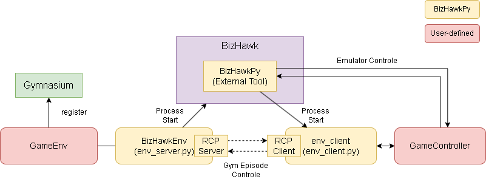

# カスタム環境(Gym)の作り方

全体イメージは以下です。  



赤枠の部分を実装する必要があります。  

- GameController: Gameを制御するメイン部分
- GameEnv: Gymへ登録する部分


## GameController

Emulatorと直接やり取りしてEnv用の関数を実装するクラスとなります。
実装例は以下です。

- `[Gym]` が Gym に関係する実装です。
- `[BizHawkPy]` が BizHawkPy に関係する実装です。

``` python
# --- gym側のimport
import gymnasium as gym

# [BizHawkPy] BizHawkEnv側のimport
# BizHawkPyにより自動で読み込まれるので実行パスの追加は不要です
import env_client
from bizhawk_api import Utils, client, emu, gui, memory


class GameController(env_client.IGameController):
    def __init__(self):

      # [Gym] gymと同じ定義で実装
      self.action_space = gym.spaces.Discrete(2)
      self.observation_space = gym.spaces.Discrete(2)

      # [BizHawkPy] rom情報を追加します
      self.rom = "ROMのパス" 
      self.rom_hash = "ROMのハッシュ値（オプション）"
    
    # [BizHawkPy] (option)
    # 実行の最初に呼ばれます。
    # info には `py/env_server.py` の _client_config の情報が入っています。
    def setup(self, info: dict):
        self.debug = info["debug"]

    # [Gym] (required)
    # エピソードの初期化を定義します。Gymと同じ定義になります。
    def reset(self, seed: Optional[int] = None, options: Optional[dict] = None) -> tuple[Any, dict]:
        state = observation_space に準拠した今の状態
        info = {}  # 任意の情報
        return state, info

    # [Gym] (required)
    # 1stepを定義します。Gymと同じ定義になります。
    # actionは action_space に準拠した値が入ります。
    def step(self, action: Any) -> tuple[Any, float, bool, bool, dict]:
        state = observation_space に準拠した今の状態
        reward = 0.0        # 報酬
        terminated = False  # エピソードが正常に終了した場合にTrue
        truncated = False   # エピソードが異常終了した場合にTrue
        info = {}  # 任意の情報
        return state, reward, terminated, truncated, info

    # ------------------------------------------
    # 以下はSRLフレームワーク用の関数で、全てオプションとなります。
    # ------------------------------------------
    # 無効なアクションがある場合はそれを返す
    def get_invalid_actions(self) -> list:
        return []

    # backup/restoreで現在の情報を復元する。
    # (QS/QLの情報は BizHawkPy 側で処理するので実装は不要です)
    def backup(self) -> Any:
        return None
    def restore(self, dat: Any):
        pass


# 最後に実行用のエントリーポイントを記載
if __name__ == "__main__":
    env_client.run(GameController())

```

## GameEnv

Gymへ登録するコードとなります。
実装例は以下です。

``` python
# gymへの登録
import gymnasium.envs.registration
gymnasium.envs.registration.register(
    id="SMB-image-v0",
    entry_point=__name__ + ":GameEnvImage",
)

# このレポジトリにある py/env_server.py を指定します。
# ここは実行時にパスが通ってる必要があります。
from py.env_server import BizHawkEnv

# BizHawkEnv を継承し、コンストラクタの引数のみを指定します。
# 必須は bizhawk_dir と python_path です。
class GameEnvImage(BizHawkEnv):
    def __init__(self, **kwargs):
        super().__init__(
            bizhawk_dir="BizHawkのディレクトリパスを指定",
            python_path="対象とする GameController が書かれたPythonファイルのパスを指定",
            **kwargs,
        )

```

その他のコンストラクタの引数は以下です。

| 引数名 | 型 | デフォルト値 | 説明 |
|--------|----|-------------|------|
| bizhawk_dir | Path \| str | - | BizHawk のディレクトリパス |
| python_path | Path \| str | - | GameController が書かれたPythonファイルのパス |
| observation_type | ObservationTypes | "VALUE" | 下記に記載 |
| frameskip | int | 0 | ステップごとにスキップするフレーム数 |
| silent | bool | True | BizHawkを無音にするかどうか |
| reset_speed | int | 800 | リセット時のエミュレーション速度 |
| step_speed | int | 800 | step 実行時のエミュレーション速度 |
| pause_before_reset | bool | False | リセット前に一時停止するかどうか |
| pause_after_reset | bool | False | リセット後に一時停止するかどうか |
| user_data | any | None | 任意のユーザーデータ（setupの引数に渡されます） |
| debug | bool | False | デバッグモードの有効化 |
| display_name | str | "" | 表示の名前を変更（SRL用） |


### ObservationTypes

`ObservationTypes` は、Env 環境が取得する状態（観測データ）の種類を指定します。

| ObservationTypes | 説明 |
|------------------|------|
| `"VALUE"` | `GameController` で定義された数値データを使用 |
| `"IMAGE"` | スクリーンショット画像を使用 |
| `"BOTH"`  | `"VALUE"` と `"IMAGE"` の両方を使用 |
| `"RAM"`   | エミュレータのメモリ（RAM）内容を使用（ハードによっては非常に高次元になります） |


具体的な実装のサンプルは `examples/BizHawkEnv` 配下を見てください。


# SRL

サンプル内で使われているSRLは別レポジトリで作っている強化学習フレームワークで以下となります。

Sample code running with the reinforcement learning framework SRL v1.4.6
https://github.com/pocokhc/simple_distributed_rl
